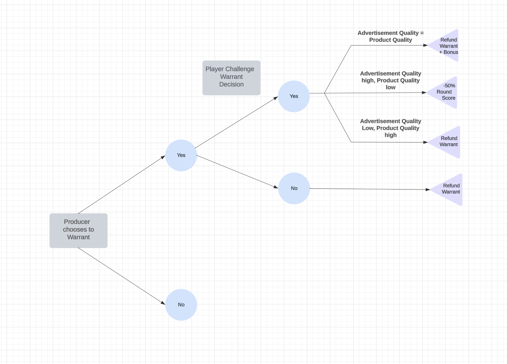

# empirica-dev

Empirica Development Repository for Experimentation.

  

For installation instructions, check out [this Google Document](https://docs.google.com/document/d/1h0MvtqK9ss_Yw3fcofB_j0B_T7V7GodYdjEjKUqiPws/edit?usp=sharing).

  

For issues to start contributing to, take a look at the open [Issues](https://github.com/Digital-Information-Research-Lab/empirica-dev/issues).

  

For details on our progress, check out the [Experiment Roadmap](https://github.com/orgs/Digital-Information-Research-Lab/projects/2) (you will need access if you can't view this, since it's private. Ping [SwapneelM](https://github.com/swapneelm))

  

# Short Answer Responses
## Short Answer #1 (Feature Implementation)

In order to plan the feature, I first sought to understand what the application was doing along with the overall goal of the application. Since Empirica is essentially the base on which this application is built, I read the Empirica documentation to understand what the exact purpose of Empirica is and why it was chosen for this application. Through my exploration of Empirica, I gained a comprehensive understanding of the game's lifecycle within this framework and key aspects such as rounds, stages, and batches. After grasping the fundamental aspects and goal of Empirica, I then focused my efforts on React since I have limited experience with it. I looked into the basics of React (via React documentation) so that I would be able to understand more when going into the codebase. In this search, I learned about topics such as component-based architecture, states, and hooks. Upon analyzing the codebase, I made a separate document to take notes on what some files in the project were doing (mainly .jsx files and server files) which then allowed me to figure out where in the code this new feature would be implemented and how it would flow with the rest of the application. I found it useful to omit or add bits of code and rerun the game to see what bits of code are reliant on others or build off of others.

From this point, I began brainstorming the warrant feature, thinking of the intent of the feature and how it affects the implementation of other features. I realized that the warrant feature is an extension rather than the central feature of the application. Therefore, I decided to follow the same design format that the other choices follow (i.e. production quality, advertisement quality) to maintain consistency and simplicity. In this way, if the UI needs formatting in the future, it can be formatted simply with the other aspects of the app. The feature required me to create new React components which were based on or similar to preexisting components along with conditional rendering of these components based on the different cases the warrant could create. 

Firstly, I started by adding another section in Advertise.jsx for the producer to choose whether they would like to warrant their product for a fixed price. This included a prompt along with a button for the producer to give their input. After making sure that their choice would be saved using console logs, I focused on conditional rendering of the resulting score in Results.jsx. This included grabbing the warrant choice, generating whether the player challenges the warrant or not, and considering these two factors to render a react component which generates a score for the round. Since I was confused about some variable names and to keep track of what I had already implemented, I made sure to comment on parts I did not understand for clarification.

Below I have linked the references I used to help me with implementing this feature:

* [Empirica Docs](https://docs.empirica.ly/overview/lifecycle)

* [React Learn](https://react.dev/learn)

* [React Tic-tac-toe](https://react.dev/learn/tutorial-tic-tac-toe#passing-data-through-props)

## Short Answer #2 (Real-world)

As it pertains to the significance and how the warrant is reflective of a real-world marketplace, it highlights the idea of verification or guarantee. In the real world, to resell an expensive item, a person may send their item to a reseller who will check to guarantee or vouch that the item is authentic and as advertised. Then, the reseller would earn a commission on their sale for verifying the item. In a similar sense, the warrant feature here is used to ensure that the producer is honest in advertising their product quality, essentially acting as a trust mechanism. In order to consider all the cases the warrant feature could imply, I created a tree diagram as shown below. 

  

After the producer chooses what they want to advertise their product as and the quality of their product, the producer has a choice to warrant the product. If they don't decide to warrant, then they can continue. If they decide to warrant the product, they will have to pay an upfront price, in my case $100. After choosing to warrant the product, the player can choose to either challenge the warrant or not. If the warrant is not challenged, then the warrant money is refunded to the producer in full. On the other hand, if the warrant is challenged, then either the producer advertised the item correctly or incorrectly in some way. If the producer advertised the item correctly and the product was warranted, then the warrant money is returned in full along with a 20% bonus to their round score. This bonus is to encourage honesty in the advertising of the product. On the other hand, if the producer warranted the product but the item was advertised incorrectly, it was advertised incorrectly in one of two ways: either the product quality is high but they advertised it as low quality or the product quality is low but they advertised it as high quality. In the first case, the producer only receives the warrant quality without a bonus. I chose to give back the warrant money in this case, since it isn't a loss for the buyer to buy a good product that was advertised as low quality. However in the latter case, if the producer advertises the product as high quality when the product quality is low, then the producer loses 50% of the round score along with losing the warrant money. This is a form of punishment for the producer in order to discourage this behavior since this type of dishonesty leads to a loss on the buyer's end, unlike the first case. 

This method of employing the warrant feature also highlights the real-world representation of a risk-reward concept. The seller initially takes on the risk of warranting their product in hopes that it not only boosts the reputation of their product but also for the reward of being truthful. As a result, this feature discourages short-term profit and encourages long-term building of reputation.
